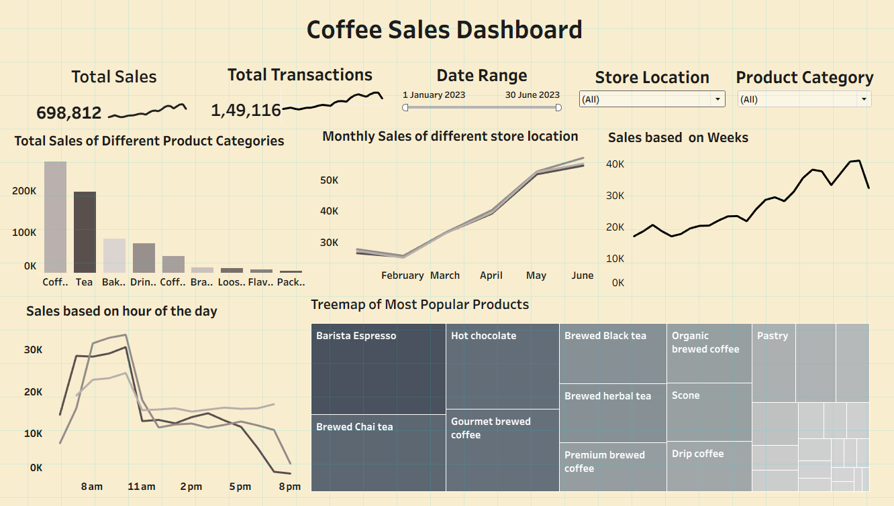

# Coffee Sales Analysis Dashboard

[View the Dashboard](https://smusab9152.github.io/Coffee_Sales_Analysis_Dashboard/)

<!-- Add a dashboard screenshot below -->


## Overview

The **Coffee Sales Analysis Dashboard** is a professional business intelligence solution designed to provide comprehensive insights into coffee sales data. This dashboard helps stakeholders monitor...

## Features

- Interactive data visualizations for sales performance
- Trend analysis by region, category, and time period
- Key metrics: total sales, top products, revenue growth, and more
- Dynamic filtering and drill-down capabilities
- Clean, user-friendly interface for business users

## Getting Started

1. **Clone the repository**
   ```sh
   git clone https://github.com/smusab9152/Coffee_Sales_Analysis_Dashboard.git
   ```

## Sample Data

Sample coffee sales data is included for demonstration purposes. Replace with your organization’s data for full analysis.

## Usage

- Explore the dashboard by interacting with charts and filters.
- Use drill-down features to analyze sales by different dimensions.
- Export visualizations or reports as needed.

## Contributing

Contributions are welcome! Please open issues or submit pull requests for improvements, new features, or bug fixes.

## License

This project is licensed under the [MIT License](LICENSE).